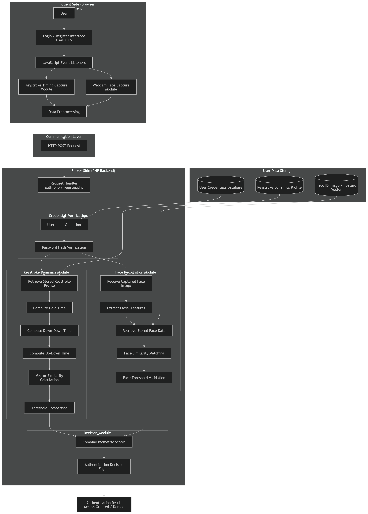
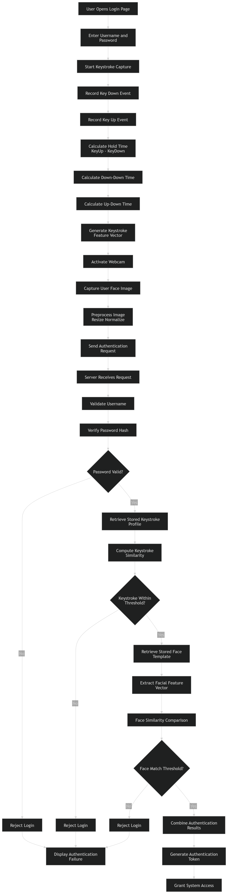
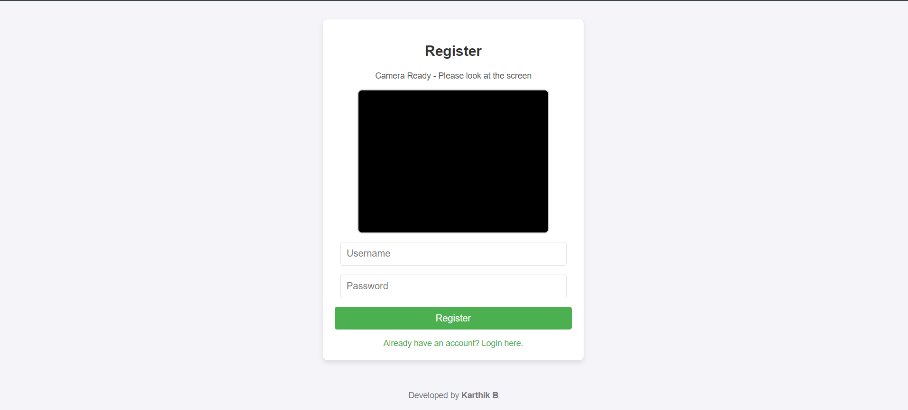
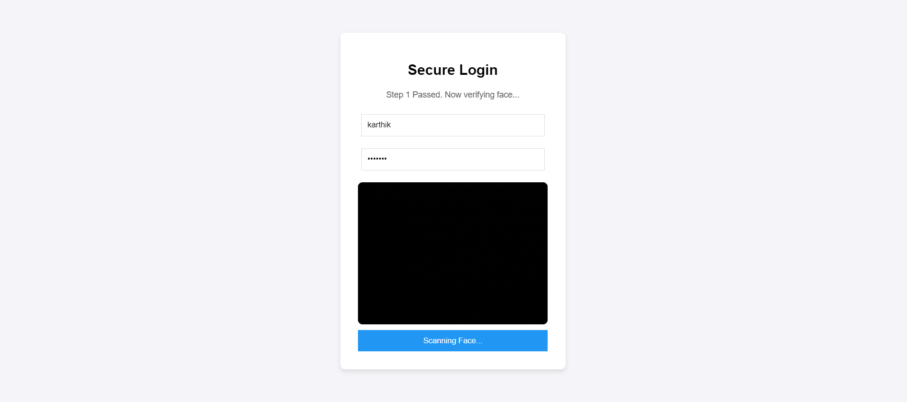

# Multi-Factor Biometric Authentication System
## Keystroke Dynamics and Face ID Verification using PHP and JavaScript


## Overview

This project implements a multi-factor biometric authentication system that strengthens traditional username and password based login mechanisms. The system integrates two biometric verification methods:

1. Keystroke Dynamics (behavioral biometric)
2. Face ID recognition using webcam capture

The goal is to increase authentication reliability by verifying both **how a user types** and **who the user physically is**.

Even if credentials are compromised, attackers cannot easily replicate both the typing rhythm and the facial identity of the legitimate user.

The system is implemented using lightweight web technologies including **PHP, JavaScript, HTML, and browser APIs**, making it deployable on standard web servers without specialized hardware.

---

## Key Features

- Username and password authentication
- Behavioral biometric verification using keystroke dynamics
- Face ID verification using webcam capture
- Multi-factor authentication workflow
- Lightweight implementation suitable for browser environments
- Easy integration with existing web systems
- Real-time biometric comparison

---

## System Architecture



The architecture consists of:

- Client-side interface for capturing typing behavior
- Webcam based face capture module
- PHP backend verification engine
- Biometric comparison algorithms
- Authentication decision module

---

## Authentication Workflow



### Registration Phase

During registration the system collects:

- Username
- Password
- Keystroke timing patterns
- Face ID image

The typing rhythm and facial identity become the user's biometric profile stored for future verification.

### Login Phase

During login the system performs the following steps:

1. User enters username and password
2. JavaScript records typing timing information
3. Webcam captures the user's facial image
4. Data is sent to the backend PHP authentication module
5. Keystroke dynamics are compared with stored patterns
6. Face identity is verified
7. If both checks pass, authentication is successful

---

## Keystroke Dynamics Algorithm

The system evaluates typing similarity using an average absolute difference method.

Difference calculation:

Difference = Σ |Ti − Ui| / n

Where:

- Ti = Stored keystroke timing value
- Ui = Current user timing value
- n = Number of keystrokes

Authentication rule:

If Difference < Threshold → User Verified  
Else → Authentication Failed

This approach allows real-time biometric verification with low computational cost.

---

## Time and Space Complexity

| Operation | Time Complexity | Space Complexity |
|-----------|----------------|----------------|
Typing Data Capture | O(n) | O(n) |
Similarity Computation | O(n) | O(n) |
Face Verification | O(f) | O(f) |
User Data Processing | O(m × n) | O(m × n) |

Where:

- n = number of keystrokes
- m = number of users
- f = facial feature vector size

---

## User Interface

### Registration Page

The registration interface allows new users to create an account and capture biometric data required for authentication.



The page performs the following tasks:

- Captures username and password
- Records keystroke timing data while typing
- Captures facial image using the webcam
- Stores biometric profile

### Login Page

The login interface verifies the user using stored biometric information.



The login page performs:

- Password verification
- Keystroke pattern comparison
- Face identity verification

Authentication is granted only when all verification checks match the stored biometric profile.

---

## Security Advantages

This system improves login security by introducing multiple biometric verification layers.

Security benefits include:

- Protection against credential theft
- Resistance to brute force login attempts
- Prevention of account takeover
- Behavioral verification of legitimate users

Since attackers must replicate both typing rhythm and facial identity, unauthorized access becomes significantly more difficult.

---

## Real World Applications

The authentication approach implemented in this project can be applied to:

- Online banking systems
- Enterprise security platforms
- Government authentication portals
- Secure enterprise login systems
- Zero-trust security environments

---

## Installation

### Step 1: Install XAMPP

Download and install XAMPP from:

https://www.apachefriends.org

Start the Apache server.

### Step 2: Place the Project

Move the project folder to:

xampp/htdocs/keystroke-face-auth

### Step 3: Run the Application

Open the browser and navigate to:

http://localhost/keystroke-face-auth/register.html

Register a user and then test authentication using the login page.

---

## Project Structure

```
Project_Keystroke_Dynamics_Authenticator_HMMs

├── auth.php
├── register.php
├── login.html
├── register.html
├── users.txt
├── README.md
│
└── screens
     ├── system_architecture.png
     ├── authentication_workflow.png
     ├── register_page.png
     └── login_page.png
```

---

## Technologies Used

| Technology | Purpose |
|-----------|--------|
HTML / CSS | User Interface |
JavaScript | Keystroke Timing Capture |
PHP | Backend Authentication |
Webcam API | Face ID Capture |
Browser Timing API | Behavioral Biometrics |

---

## License

This project is licensed under the GPL-3.0 License.

---

## Author

Karthik B
Sai Sathiya Krishna A K
Adharsh Ramakrishnan 

